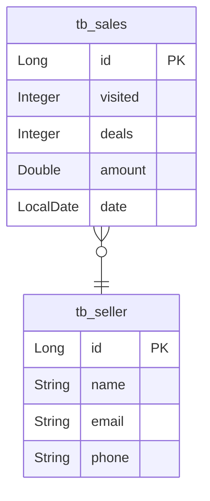

# 📝 CONSULTA VENDAS
📍 DEVSUPERIOR / JAVA SPRING PROFESSIONAL / CHALLENGES<br>
📅 September 02, 2023 - 🚩 São Paulo, Brazil - 😁 Mauricio Mityo Hidani<br>

Versões utilizadas no desafio:

- [Java 17](https://docs.aws.amazon.com/corretto/latest/corretto-17-ug/what-is-corretto-17.html)
- [Maven 3.1.0](https://maven.apache.org/docs/3.1.0/release-notes.html)
- [Spring 2.7.3](https://docs.spring.io/spring-boot/docs/2.7.3/reference/html/)


# Descrição do desafio

Trata-se de um sistema de vendas (Sale) e vendedores (Seller). Cada venda está para um vendedor, e um vendedor pode ter várias vendas.



Você deverá implementar as seguintes consultas (ambas deverão estar corretas):


## Relatório de vendas

1. **[IN]** O usuário informa, opcionalmente, data inicial, data final e um trecho do nome do vendedor.
2. **[OUT]** O sistema informa uma listagem paginada contendo id, data, quantia vendida e nome do vendedor, das vendas que se enquadrem nos dados informados.

Informações complementares:

- Se a data final não for informada, considerar a data atual do sistema. Para instanciar a data atual, utilize o comando:

```java
    LocalDate today = LocalDate.ofInstant(
            Instant.now(), 
            ZoneId.systemDefault()
        );
```

- Se a data inicial não for informada, considerar a data de 1 ano antes da data final. Para instanciar uma data com um ano a menos, use a função `minusYears`:

```java
    LocalDate result = minhaData.minusYears(1L);
```

- Se o nome não for informado, considerar o texto vazio.
- Dica: receba todos os dados como `String` no controller, e faça os tratamentos das datas acima, instanciando os objetos `LocalDate`, no service.


## Sumário de vendas por vendedor

1. **[IN]** O usuário informa, opcionalmente, data inicial, data final.
2. **[OUT]** O sistema informa uma listagem contendo nome do vendedor e soma de vendas deste vendedor no período informado.

Informações complementares:

- As mesmas do caso de uso Relatório de vendas

**link da collection Postman**: https://www.getpostman.com/collections/dea7904f994cb87c3d12


### Sumário de vendas por vendedor (teste 1)
GET /sales/summary?minDate=2022-01-01&maxDate=2022-06-30
* `Deverá retornar o sumário de vendas por vendedor no período informado:`
```json
[
    {
      "sellerName": "Anakin",
      "total": 110571.0
    },
    {
      "sellerName": "Logan",
      "total": 83587.0
    },
    {
      "sellerName": "Loki Odinson",
      "total": 150597.0
    },
    {
      "sellerName": "Padme",
      "total": 135902.0
    },
    {
      "sellerName": "Thor Odinson",
      "total": 144896.0
    }
]
```


### Sumário de vendas por vendedor (teste 2)
GET /sales/summary
* `Deverá retornar o sumário de vendas por vendedor dos últimos 12 meses.`


### Relatório de vendas (teste 1)
GET /sales/report
* `Deverá retornar o relatório de vendas dos últimos 12 meses.`

### Relatório de vendas (teste 2)
GET /sales/report?minDate=2022-05-01&maxDate=2022-05-31&name=odinson
* `Deverá retornar o relatório de vendas do período/vendedor informados:`

```json
{
    "content": [
        {
            "id": 9,
            "date": "2022-05-22",
            "amount": 19476.0,
            "sellerName": "Loki Odinson"
        },
        {
            "id": 10,
            "date": "2022-05-18",
            "amount": 20530.0,
            "sellerName": "Thor Odinson"
        },
        {
            "id": 12,
            "date": "2022-05-06",
            "amount": 21753.0,
            "sellerName": "Loki Odinson"
        }
    ],
...
```
